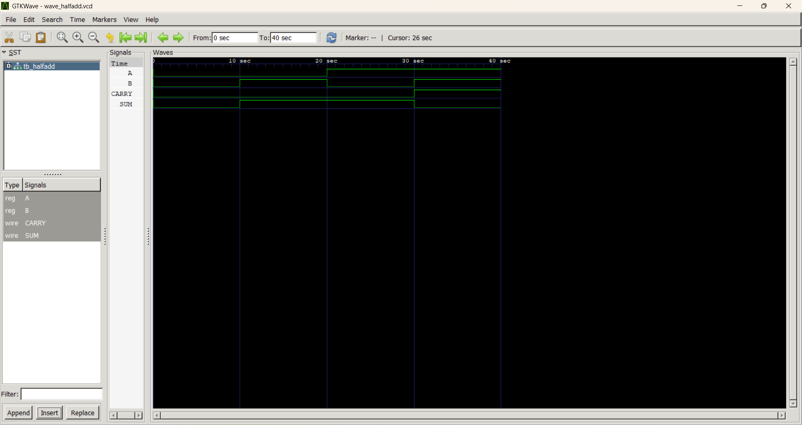
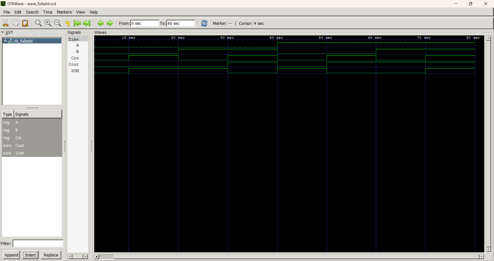
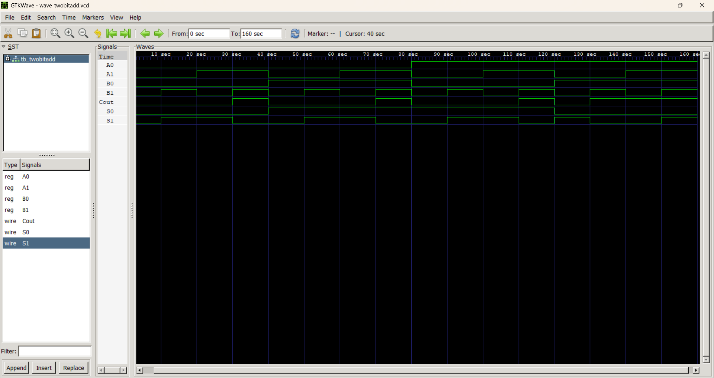
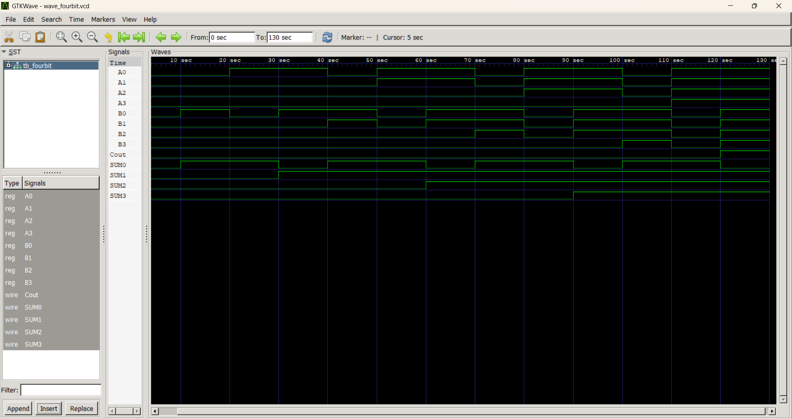
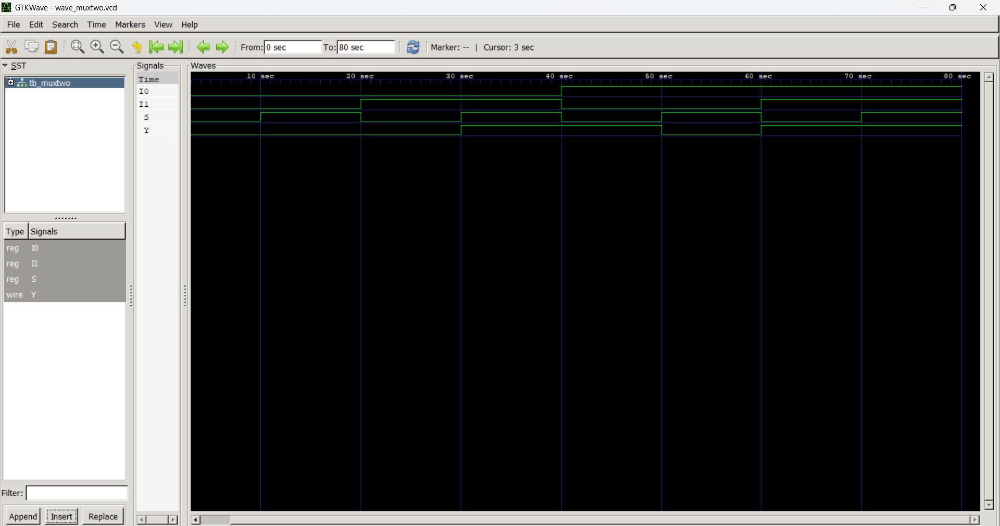
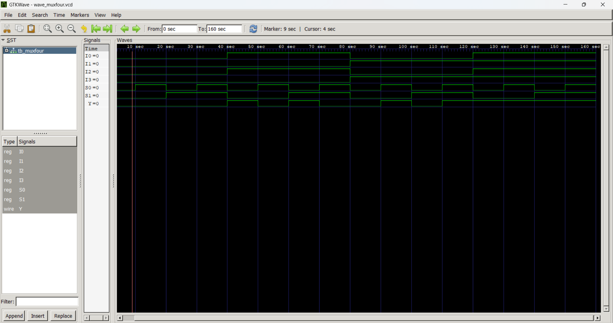
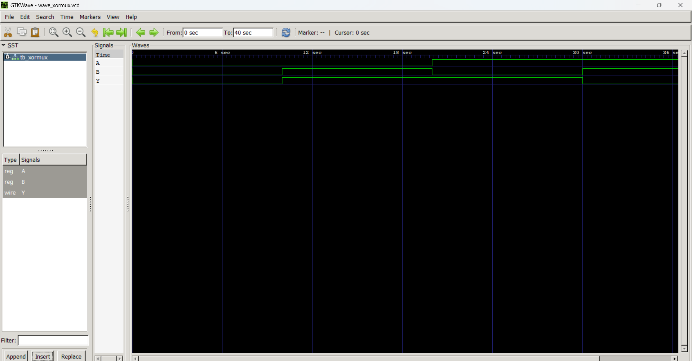
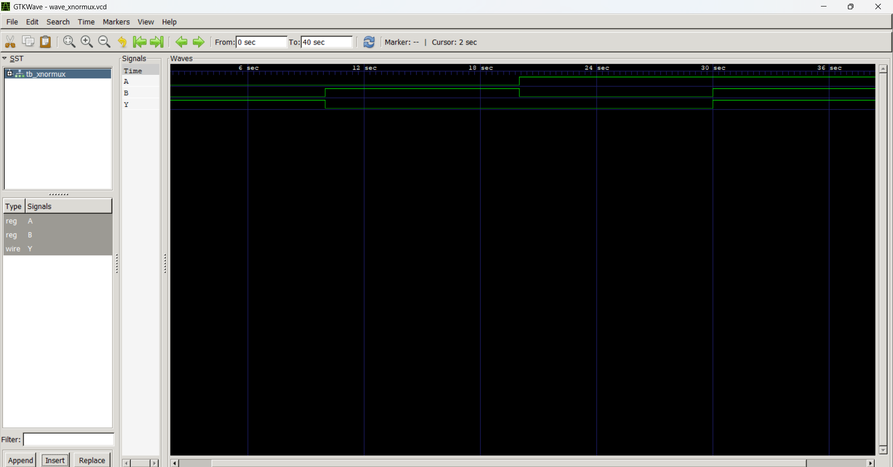

# Digital Design using Verilog

This repository contains fundamental digital design implementations using Verilog. The focus is on understanding hardware behavior through modular design, hierarchical construction, and verification using testbenches and waveform analysis.

## About Me

I am Devjit Pramanik, a first-year ECE student exploring digital design and hardware systems. I am currently focused on building a strong foundation in digital logic and Verilog through hands-on projects and simulation.
I enjoy understanding how hardware works at a fundamental level and aim to gradually progress towards designing complex systems such as processors and system-level architectures.
I believe in learning by building and verifying real implementations rather than only studying theory.

## Highlights

- Designed logic gates using NAND as a universal gate  
- Implemented Half Adder and Full Adder  
- Built 2-bit and 4-bit adders using modular design  
- Designed 2:1 and 4:1 Multiplexers using hierarchical approach  
- Implemented XOR and XNOR using 4:1 MUX (lookup table concept)  
- Verified all designs using testbenches and waveform outputs  

## Projects Included

### 1. Half Adder
- Adds two single-bit inputs
- Outputs: SUM and CARRY

### 2. Full Adder
- Adds three inputs (A, B, Cin)
- Outputs: SUM and Cout

### 3. 2-bit Adder 
- Adds two 2-bit binary numbers
- Built using Half Adder and Full Adder (modular design)

### 4. 4-bit Ripple Carry Adder 
- Adds two 4-bit binary numbers
- Implemented using four full adders (modular design)
- Also demonstrates carry propagation from LSB to MSB (ripple carry effect) 

## Multiplexer (MUX) Designs

### 2:1 MUX
- Selects one of two inputs based on control signal
- Implemented using conditional operator
- Verified using testbench and waveform

### 4:1 MUX
- Selects one of four inputs using two select lines (S1, S0)
- Implemented using hierarchical design (2:1 MUX as building block)
- Demonstrates multi-level selection logic
- Fully verified with multiple input combinations and waveform analysis

The designs emphasize hardware-level thinking, where signals represent physical connections and selection is performed through control-driven routing rather than sequential computation.

## MUX-Based Logic Implementation

### XOR using 4:1 MUX
- Implemented XOR by mapping truth table outputs to MUX inputs  
- I0 = 0, I1 = 1, I2 = 1, I3 = 0  

### XNOR using 4:1 MUX
- Implemented XNOR using MUX-based logic  
- I0 = 1, I1 = 0, I2 = 0, I3 = 1  

### Key Concepts
- Data selection vs computation
- Select lines as control signals
- Hardware interpretation of conditional operator
- Parallel and continuous signal behavior
- A multiplexer can act as a lookup table, where select lines represent the address and inputs store the output values of a truth table.

## Waveform Results

### Half Adder

### Full Adder

### 2-bit Adder

### 4-bit Ripple Carry Adder

### 2:1 MUX 

### 4:1 MUX

### XOR using MUX

### XNOR using MUX

## NAND-Based Implementations (Universal Gate Design)

To strengthen understanding of digital logic, the following circuits have been implemented using only NAND gates:

- NOT using NAND
- AND using NAND
- OR using NAND
- XOR using NAND (4-gate optimal design)
- XNOR using NAND (5-gate optimal design)
- Half Adder using NAND (optimized to 5 gates using signal reuse)
- Full Adder using NAND (optimized to 9 gates using intermediate signal reuse)

These implementations demonstrate how complex digital circuits can be constructed using a single universal gate while minimizing redundant computations.

## Concepts Covered

- Logic Gates and Combinational Circuits  
- Universal Gates (NAND-based design)  
- Modular and Hierarchical Design in Verilog  
- Gate-Level Optimization  
- Multiplexer (MUX) Design and Applications  
- MUX as a Logic Implementation Tool  
- Testbench Writing and Simulation  
- Waveform Analysis and Verification  
- Hardware-oriented thinking (parallel and continuous signals)

## Future Work

- Design and implement ALU  
- Explore sequential circuits (Flip-Flops, Counters)  
- Implement FSM-based designs  
- Move towards FPGA-based implementation  

## Tools Used
- Icarus Verilog
- GTKWave

## Interests and Goals

I am deeply interested in digital design, computer architecture, and hardware system development.

My focus is on building a strong foundation in:
- Verilog and SystemVerilog (RTL design)
- Digital circuits and their implementation
- Hardware simulation and verification
- FPGA-based system design

I am particularly interested in processor design and architecture, and I aim to work towards designing complete systems, including RISC-V based processors and System-on-Chip (SoC) architectures.

Currently, I am following a structured learning path that involves hands-on projects, simulation, and gradual progression towards advanced hardware design and architecture concepts.
